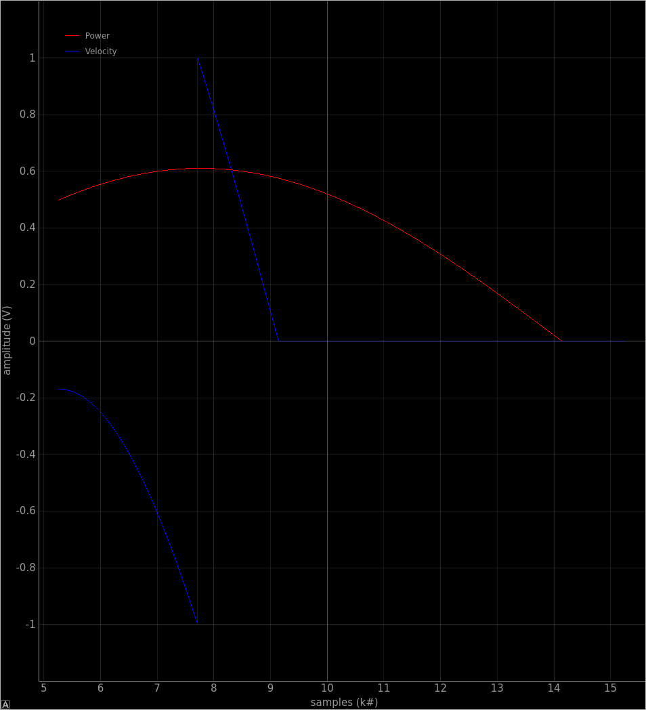

# nova_pid_viz
A quick n' dirty python script that plots realtime Power and Velocity CAN messages, for tuning PIDs.

# Install
```bash
git clone https://github.com/leighleighleigh/nova_pid_viz
cd nova_pid_viz
python3 -m pip install -r requirements.txt
```

# Usage
Example for can0 bus
```bash
# For help
python3 nova_pid_viz.py -h 
# For can0 with bitrate 20000, id 0x450, history of 1000 messages
python3 nova_pid_viz.py -h 
```

# Screencap

